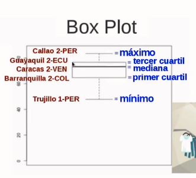

# Introduction

Instructor: [Sonia Ardila](https://www.linkedin.com/in/sonia-ardila-5b44094/)

- Big Data != Small Data

- R fue creado en Auckland University, aunque se cree que en los 70's en AT&T como evlucion del lenguaje S

- Tambien python sirve para manejar datos

## Topics

- Estructuras, tipos de datos y sintaxis
- EDA Explortatory data analysis
- Estadística descriptiva
- Ajuste de datos: subsetting, filtrado, selección
- Visualización de datos
- Organizacion de información en R markdown
- Proyecto final

Data Set del proyecto:

[Orange Economy](https://github.com/sap0408/Orange-Economy)

## Instalación de R

[**R**](https://cran.r-project.org/)

[**R Studio**](https://www.rstudio.com/products/rstudio/download/)

## Introducción al lenguaje

Asignacion de variables 

```r
x <- 86
x
```


# BOXPLOT

[¿Cómo interpretar el boxplot?](https://platzi.com/clases/1445-fundamentos-r/16014-box-plot-y-su-interpretacion/)

